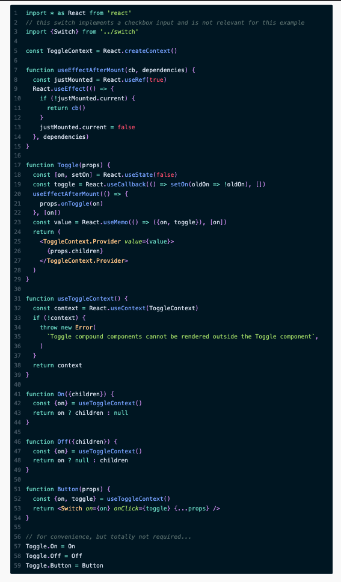

## Compound Components

A way to use structured components together to share an implicit state, and allowing these components to communicate

-   Use React API to transform some of the components

Think of compound components like the `<select>` and `<option>` elements in HTML. If these components are apart they don’t do too much, However if they are together, they allow you to create the complete experience. 
> Kent C. Dodds

```html
<select>
  <option value="1">Option 1</option>
  <option value="2">Option 2</option>
</select>
```

The `<select>` is the element responsible for managing the state of the UI, and the `<option>` elements are essential in order to facilitate futher configuration for the way in which the select element should operate (specifically, which options are available and their values).

Let's imagine that we were going to implement this native control manually. A naive implementation would look something like this:

```jsx
<CustomSelect
  value={value}
  onChange={handleSelectChange}
  options={[
    {value: '1', display: 'Option 1'},
    {value: '2', display: 'Option 2'},
  ]}
/>
```

This works fine, but it is less extensible/flexible than a compound components API. For example; if you want to supply additional features to the `<option>` element that is rendered, or if you want to display in order to change based on whether it's selected? You can easily add API surface area to support these use cases, but in turn it simply means that it is just more for you to code and ultimately more for users to learn. That is  where compound components come in really handy!

Here is what it looks like when using the compound component pattern:

```jsx
<CustomSelect value={value} onChange={handleSelectChange}>
  <CustomSelect.Option value="1">Option 1</CustomSelect.Option>
  <CustomSelect.Option value="2">Option 2</CustomSelect.Option>
</CustomSelect>;
```

As you can see now the component is now expressed in a more declarative fashion.

### Why do I need it when I have render props?

[Render props](../render-props-pattern/) is a great pattern. It is very versatile and easy to understand,  However this doesn’t mean that we have to use it everywhere. If used carelessly it can lead to obfuscated code.

### Benefits of compound component pattern

- The developer owns the markup
- The developer can rearrange the components in any order
- The components don’t have to be jammed together explicitly, they can be written independently but they are still able to communicate. 

### How it works

- The parent component (CustomSelect) has some state.
- CustomSelect shares it’s state and methods with child components.
- The child component Option uses the shared methods to communicate with CustomSelect.


### Putting the Pattern Into Action

```js
import * as React from 'react'
import {Switch} from '../switch'

function Toggle() {
  const [on, setOn] = React.useState(false)
  const toggle = () => setOn(!on)

  // 🐨 replace this with a call to React.Children.map and map each child in
  // props.children to a clone of that child with the props they need using
  // React.cloneElement.
  // 💰 React.Children.map(props.children, child => {/* return child clone here */})

  return <Switch on={on} onClick={toggle} />
}

// Accepts `on` and `children` props and returns `children` if `on` is true
const ToggleOn = () => null

// Accepts `on` and `children` props and returns `children` if `on` is false
const ToggleOff = () => null

// Accepts `on` and `toggle` props and returns the <Switch /> with those props.
const ToggleButton = () => null

function App() {
  return (
    <div>
      <Toggle>
        <ToggleOn>The button is on</ToggleOn>
        <ToggleOff>The button is off</ToggleOff>
        <ToggleButton />
      </Toggle>
    </div>
  )
}

export default App

```

> Kent C. Dodds


### Implementation using the Flexible Compound Components Pattern





Next [>> Render props](../render-props-pattern/) 
